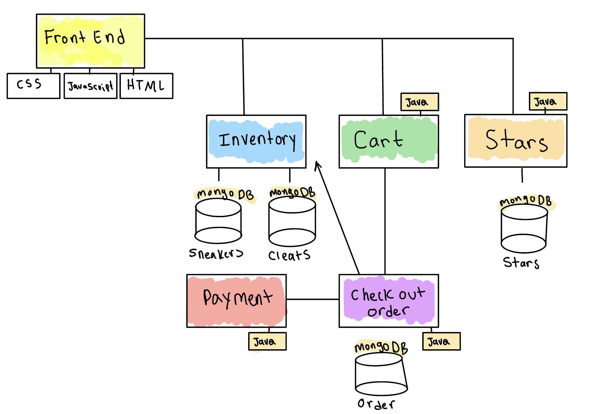

# Keelyn's Course Project Kick Start Updated 4/10 

## Application Nature and Purpose
The nature of this application will be a web based athletic shoe store. Clients will have the option to buy athletic sneakers or cleats. There will be two seperate catalogs depending on what the user would like to browse. Users will also be able to star shoes for a later purchase. Once shoes are ordered they will be stored in a "previous orders" section where their orders wil be displayed. The website will also keep track of the previously starred shoes of the user so they can revisit shoes that they had been interested in prior. 

## Module Lay Out

## People Involved
I will be working independently on this project. 

## Estimated modules
Here are the microservices I hope to implement:

Order Placement Service 

Order Status Update Service

Shoe orders will be stored in an Order DB

Add/Delete Star Shoe Service 

Starred shoes will be stored in a Starred Shoe DB 

Purchase Service 

Sneakers and Cleats can be stored in sneaker DB

Check Out Service 

## Statement of the estimated languages and frameworks

*Not fully complete still working through what languages would be best *

HTML and CSS - Front End Components

H2 - for databases

Java and SpringBoot for Modules

## General description of the UI with the primary actions
The user will be able to place orders for either sneaker or cleats depending on item number. Users will have the option to buy the shoe or star the shoe. Once ordered, shoe info will be displayed. There will be two tabs in the upper part of the UI that are "orders" and "stars" these will hold previous/current orders and their completition status as well as the previously starred shoes.
